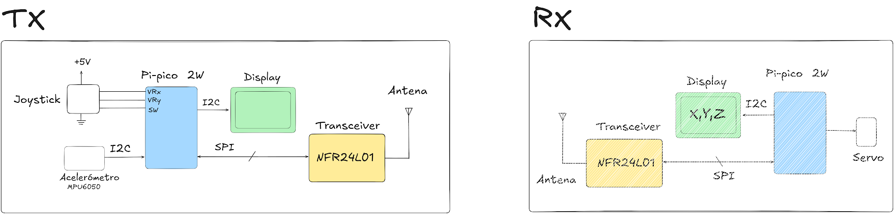

# Control Remoto Inalámbrico con Raspberry Pi Pico y nRF24L01

Este repositorio contiene el código y la documentación para un sistema de control remoto inalámbrico implementado con dos microcontroladores Raspberry Pi Pico 2W y módulos de radiofrecuencia nRF24L01. El sistema consiste en una unidad transmisora (TX) que lee datos de un joystick y un acelerómetro, y una unidad receptora (RX) que utiliza estos datos para controlar un servomotor.

## Características Principales

- **Comunicación Inalámbrica:** Utiliza el transceptor nRF24L01 que opera en la banda ISM de 2.4 GHz para una comunicación de bajo costo y bajo consumo.
- **Doble Entrada de Control:** El transmisor permite el control a través de un joystick analógico y un sensor de movimiento (acelerómetro MPU6050).
- **Plataforma MicroPython:** El código está desarrollado en MicroPython, facilitando la programación y el prototipado en el Raspberry Pi Pico.
- **Validación con Instrumentación:** El proyecto fue verificado utilizando un analizador lógico, osciloscopio y analizador de espectro para garantizar la integridad de la señal en cada etapa.

## Hardware Utilizado

El sistema se dividió en un módulo transmisor y uno receptor, compuestos por los siguientes elementos:

### Módulo Transmisor (TX)
- Microcontrolador **Raspberry Pi Pico 2W**
- Módulo Transceptor **nRF24L01+**
- Módulo **Joystick Analógico**
- Acelerómetro/Giroscopio **MPU6050**
- Display **OLED I2C** (para depuración)
- Protoboard y cables de conexión

### Módulo Receptor (RX)
- Microcontrolador **Raspberry Pi Pico 2W**
- Módulo Transceptor **nRF24L01+**
- **Servomotor SG90**
- Display **OLED I2C** (para visualizar datos recibidos)
- Protoboard y cables de conexión

## Software y Configuración

1.  **Firmware:** Ambos Raspberry Pi Pico deben tener instalado el firmware de **MicroPython**.
2.  **IDE:** Se utilizó **Thonny IDE** para la carga de los scripts y la interacción con las placas.
3.  **Librerías:** Se usaron librerías de MicroPython para el manejo del `nRF24L01`, `MPU6050` y el display `SSD1306` (OLED).
4.  **Archivos del Proyecto:**
    -   `TX.py`: Script principal para el módulo transmisor.
    -   `RX.py`: Script principal para el módulo receptor.

## Validación y Resultados

Para verificar el correcto funcionamiento del sistema, se realizaron las siguientes mediciones:

### 1. Análisis de Comunicación SPI
Se utilizó un analizador lógico para monitorear la comunicación entre el Pi Pico y el nRF24L01. Las capturas muestran los paquetes de datos enviados de manera periódica, confirmando que el microcontrolador está enviando las lecturas de los sensores al transceptor.

### 2. Análisis de la Señal de Control (PWM)
Con un osciloscopio, se midió la señal PWM generada en el receptor para controlar el servomotor. La señal tiene un período de ~20 ms (50 Hz), que es el estándar para este tipo de actuadores.

### 3. Análisis de Espectro de RF
Un analizador de espectro confirmó la transmisión inalámbrica. Se detectó un pico de señal en la banda de 2.4 GHz, correspondiente a la frecuencia de operación del nRF24L01, validando que el transmisor estaba emitiendo la señal portadora con la información.

## Licencia

Este proyecto se distribuye bajo la Licencia MIT. Consulta el archivo `LICENSE` para más detalles.
